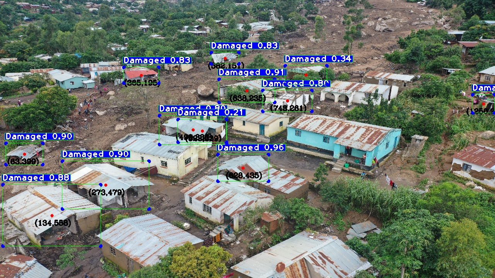
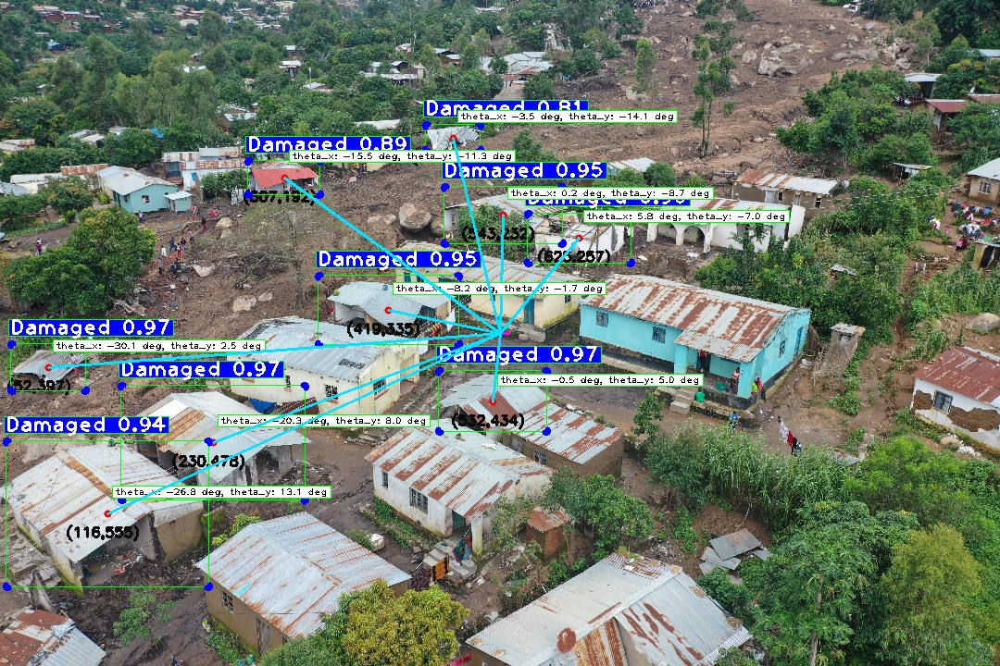
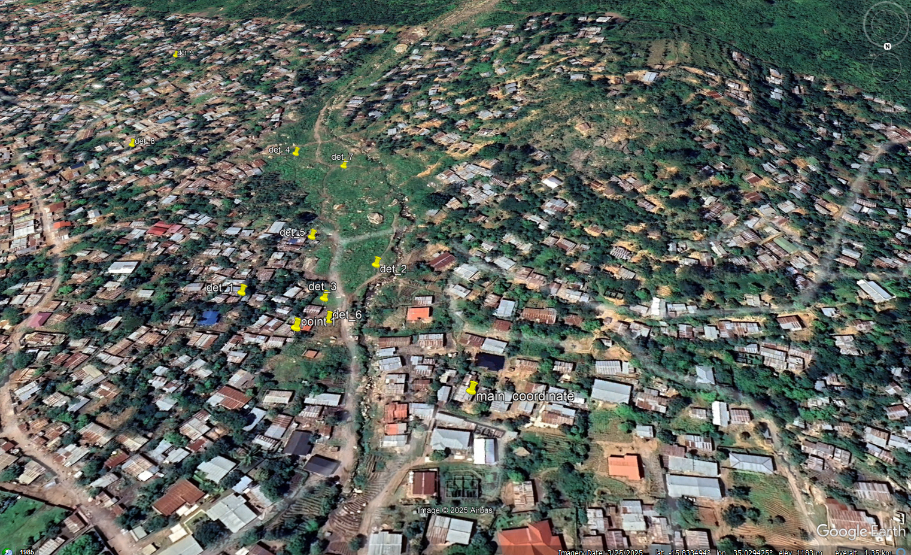

# yolo-detection-to-gps-coordinates
A drone-based computer vision framework that projects YOLO detections from angled images onto GPS coordinates, enhancing situational awareness by leveraging camera intrinsics and extrinsics extracted from EXIF metadata.
sections.  
# Drone Vision for Georeferenced Object Detection

## Motivation & Context  
Disaster response demands **georeferenced situational awareness**, not just bounding boxes. While YOLO provides real-time damage detection, outputs remain in **pixel space**. This framework bridges the gap, projecting detections onto **GPS coordinates** using camera intrinsics, extrinsics, and EXIF/XMP metadata.  

---

## Pipeline Overview  
1. **Metadata Extraction** – Intrinsics (focal length, pixel pitch) + extrinsics (tilt, yaw, altitude) from EXIF/XMP.  
2. **FOV Computation** – Horizontal/Vertical FOV define angular coverage.  
3. **YOLO Detection** – Custom-trained model detects damaged structures.

   
   
4. **Pixel → Angles** – Convert detection centers to angular offsets:

 
   
5. **Ground Projection** – Tilt + altitude intersect detection rays with the ground plane.
   
  

6. **Georeferencing** – Rotate offsets via yaw → ENU → GPS coordinates.  
7. **Export** – CSV for tabular analysis, KML for Google Earth visualization.

  
---

## Scientific Basis  
- **Computer Vision (YOLO):** CNNs transform pixels into semantic detections.  
- **Camera Geometry:** Pinhole camera model with intrinsics/extrinsics.  
- **Projection Trigonometry:** Pixels → angles → ground intersections.  
- **Geodesy & GIS:** ENU offsets transformed into geographic coordinates.  
- **Remote Sensing:** EXIF altitude and SRTM ground models provide terrain-aware correction.

## Future Development  
This framework establishes the foundation for **pixel-to-GPS georeferencing of drone detections**, but several critical extensions remain for real-world impact:  

- **Real-Time Integration** – Evolve from offline inference to a streaming pipeline where detections are instantly georeferenced and relayed to an **Emergency Command Centre**, minimizing delays in field deployment.  
- **Swarm Drone Coordination** – Extend to multi-UAV systems where fleets of drones collaboratively map affected zones. Coordinated coverage reduces blind spots, while redundant detections improve confidence.  
- **Edge + Cloud Fusion** – Onboard inference at the edge (drone GPUs) combined with centralized fusion servers would allow both speed and global situational awareness.  
- **Human-in-the-Loop Validation** – Build interfaces where responders can **validate or dismiss detections in real-time**, increasing reliability for life-critical decisions.  
- **Dynamic Terrain Awareness** – Integrate near real-time elevation models (LiDAR, satellite feeds) to improve accuracy over rugged terrain where SRTM may lag.  
- **Scalability & Interoperability** – Develop APIs that seamlessly connect this toolkit with existing GIS platforms, disaster dashboards, and humanitarian coordination systems (e.g., UN OCHA, Red Cross).  

The long-term vision is a **fully autonomous, multi-drone situational awareness system** where object detections become georeferenced intelligence within seconds, **saving lives by directing responders to the right place at the right time**. 

 https://github.com/user-attachments/assets/6108d663-d256-41a1-836f-30a3b3230d1f

